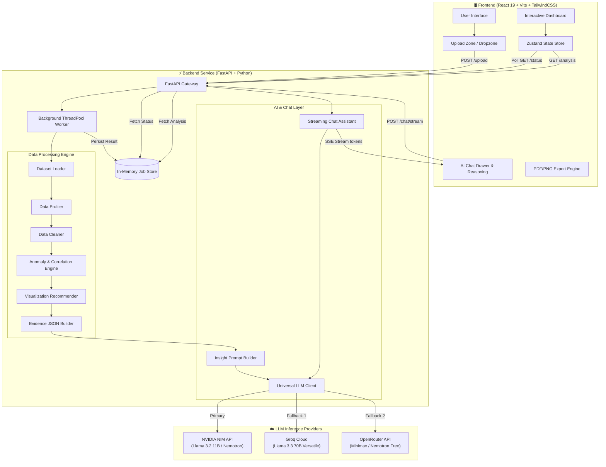
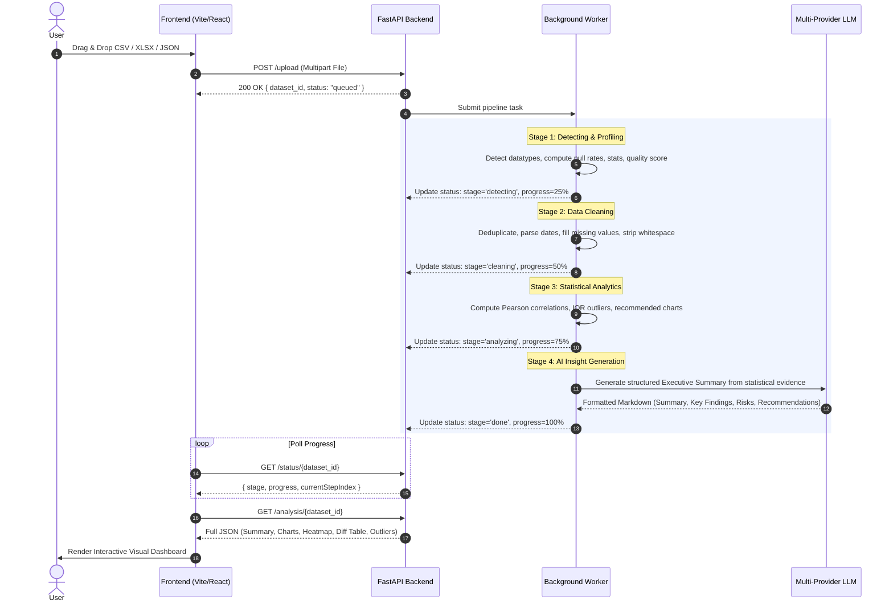
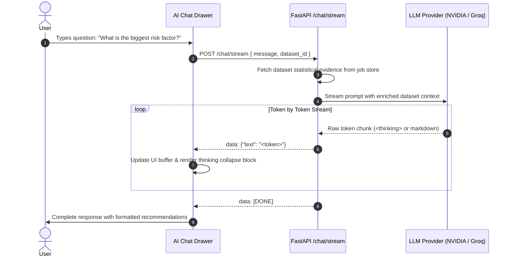

<div align="center">

# ⚡ HackMee: The Automated Insight Analyst

### *Turn Raw, Complex Datasets into Executive Plain-Language Insights & Interactive Analytics in Seconds*

[](https://python.org)
[](https://fastapi.tiangolo.com)
[](https://react.dev)
[](https://www.typescriptlang.org)
[](https://vitejs.dev)
[](https://tailwindcss.com)
[](https://build.nvidia.com)
[](https://groq.com)
[](LICENSE)

[**Explore Demo**](#-getting-started) • [**Architecture & Workflows**](#-system-architecture--workflows) • [**Tech Stack**](#-technology-stack) • [**API Reference**](#-api-reference)

</div>

---

## 📖 Table of Contents

- [Overview](#-overview)
- [Key Features](#-key-features)
- [System Architecture & Workflows](#-system-architecture--workflows)
  - [1. End-to-End System Architecture](#1-end-to-end-system-architecture)
  - [2. Automated Data Processing Pipeline Flow](#2-automated-data-processing-pipeline-flow)
  - [3. Streaming Conversational AI Flow](#3-streaming-conversational-ai-flow)
- [Technology Stack](#-technology-stack)
- [Repository Structure](#-repository-structure)
- [Getting Started](#-getting-started)
  - [Prerequisites](#prerequisites)
  - [Backend Setup (FastAPI)](#backend-setup-fastapi)
  - [Frontend Setup (React + Vite)](#frontend-setup-react--vite)
  - [Optional: Standalone Streamlit App](#optional-standalone-streamlit-app)
- [API Reference](#-api-reference)
- [Environment Configuration](#-environment-configuration)
- [Contributing](#-contributing)
- [License](#-license)

---

## 🌟 Overview

**HackMee (The Automated Insight Analyst)** is an enterprise-grade AI analytics platform designed to bridge the gap between raw data and executive decision-making. 

Instead of writing repetitive data cleaning scripts and building charts manually, users simply drag and drop any dataset (`.csv`, `.xlsx`, `.json`). HackMee instantly profiles the data, cleans anomalies, executes statistical modeling (correlations, distributions, outliers), and streams back plain-language, executive-ready insights powered by multi-provider LLMs (NVIDIA NIM, Groq, OpenRouter).

```
Raw Spreadsheets (.csv, .xlsx, .json)
                 │
                 ▼
 ┌─────────────────────────────────────────┐
 │ ⚡ Automated Data Ingestion & Profiling  │
 │ 🧹 Smart Cleaning & Imputation Engine   │
 │ 📊 Dynamic Chart & Correlation Engine   │
 │ 🤖 Multi-Provider LLM Insight Engine    │
 └─────────────────────────────────────────┘
                 │
                 ▼
 Interactive Executive Dashboard & Streaming AI Assistant
```

---

## ✨ Key Features

- **🚀 Instant Automated Profiling**: Computes row/column counts, missing rate, duplicate frequency, data types, and generates an overall **Data Quality Score**.
- **🧹 Intelligent Preprocessing & Cleaning**:
  - Auto-detects and parses dates across varying formats.
  - Imputes numerical missing values via statistical median and categoricals via mode.
  - Normalizes whitespace, removes constant/redundant columns, and standardizes column naming conventions.
  - Provides a side-by-side **Before vs. After Cleaning Diff View**.
- **📊 Interactive Visualization Studio**:
  - Dynamically recommended charts powered by **Recharts** (bar, line, scatter, grouped distributions).
  - Interactive **Pearson Correlation Matrix** with heatmap tooltips.
  - Anomaly and Outlier breakdown using IQR & Z-score statistical boundaries.
- **🧠 Multi-Provider AI Executive Insights**:
  - Synthesizes findings into crisp **Executive Summary**, **Key Metrics**, **Risks**, and **Actionable Recommendations**.
  - No numerical hallucinations: strictly grounded on statistical evidence JSON.
- **💬 Conversational AI Assistant with Live Reasoning**:
  - Chat with your dataset using Server-Sent Events (SSE) token streaming.
  - Transparent `<thinking>` reasoning display so users can see how the AI derived its conclusions.
  - Automatic fallback chain: **NVIDIA NIM (Llama 3.2 11B / Nemotron)** ➔ **Groq (Llama 3.3 70B)** ➔ **OpenRouter (Minimax / Nemotron)**.
- **📑 Export & Sharing**: Export full analytics reports as high-resolution PDF or PNG, and share interactive dashboards with stakeholders.

---

## 📐 System Architecture & Workflows

### 1. End-to-End System Architecture



---

### 2. Automated Data Processing Pipeline Flow



---

### 3. Streaming Conversational AI Flow



---

## 🛠️ Technology Stack

| Layer | Technology | Purpose |
| :--- | :--- | :--- |
| **Frontend Framework** | **React 19** + **TypeScript** | High-performance reactive component hierarchy |
| **Build & Tooling** | **Vite 6** | Ultra-fast HMR and optimized production bundling |
| **Styling & Design** | **TailwindCSS v4**, **Lucide Icons** | Modern glassmorphic, responsive dark/light UI |
| **Data Visualization** | **Recharts**, **Plotly** | Dynamic responsive charts, heatmaps, and scatter plots |
| **Animations & FX** | **Framer Motion**, **Canvas Confetti** | Smooth transitions, stepper indicators, and micro-interactions |
| **State Management** | **Zustand** | Lightweight global store for datasets, auth, and theme |
| **Backend API Gateway** | **FastAPI** (Python 3.11+) | Async high-throughput REST and SSE streaming endpoints |
| **Data Processing Engine**| **Pandas**, **NumPy**, **Scikit-learn** | Data profiling, statistical cleaning, IQR outlier detection |
| **LLM Inference** | **NVIDIA NIM**, **Groq**, **OpenRouter** | Multi-model fallback LLM inference (Llama 3.2/3.3, Nemotron, Minimax) |
| **Dependency Manager** | **uv** (Astral) | Lightning-fast Python package and virtualenv management |
| **Export Engines** | **jsPDF**, **html2canvas** | High-fidelity client-side PDF/PNG report generation |

---

## 📁 Repository Structure

```
HackMee/
├── 📁 Backend/                         # FastAPI & Python Analytics Core
│   ├── 📁 src/
│   │   ├── 📁 ai/                     # AI Insight & Chat Engine
│   │   │   ├── chat_assistant.py      # Streaming assistant with reasoning extractor
│   │   │   ├── insight_analyzer.py    # Automated dataset summarization
│   │   │   ├── llm.py                 # Multi-provider client (NVIDIA / Groq / OpenRouter)
│   │   │   └── prompt_builder.py      # Evidence-grounded prompt templates
│   │   ├── 📁 analytics/              # Statistical calculations
│   │   │   ├── anomaly_detector.py    # IQR & Z-score outlier detection
│   │   │   └── filters.py             # Numerical and categorical query filters
│   │   ├── 📁 ingestion/              # Ingestion & format parsers
│   │   │   └── loader.py              # CSV, XLSX, and JSON loader
│   │   ├── 📁 preprocessing/          # Cleaning & transformation
│   │   │   ├── cleaner.py             # Deduplication, imputation, date parsing
│   │   │   └── profiler.py            # Types, missingness, quality scores
│   │   └── 📁 visualization/          # Chart generation
│   │       ├── charts.py              # Plotly chart builders
│   │       └── recommendations.py     # Smart chart selection heuristics
│   ├── 📁 samples/                    # Sample test datasets
│   │   ├── customer_churn.csv
│   │   └── ecommerce_sales.csv
│   ├── api.py                         # FastAPI application & endpoints
│   ├── app.py                         # Standalone Streamlit dashboard
│   ├── pyproject.toml                 # Backend dependencies & metadata
│   └── uv.lock                        # Locked Python dependency graph
│
├── 📁 Frontend/                        # React + TypeScript + Vite Dashboard
│   ├── 📁 src/
│   │   ├── 📁 api/                    # API clients & TypeScript types
│   │   │   ├── client.ts              # Axios HTTP client with interceptors
│   │   │   ├── service.ts             # Dataset & chat API services
│   │   │   └── types.ts               # Strict TypeScript contract interfaces
│   │   ├── 📁 components/             # Reusable UI component library
│   │   │   ├── 📁 auth/               # Login & guest authentication modals
│   │   │   ├── 📁 common/             # Badges, buttons, error boundaries, backgrounds
│   │   │   ├── 📁 dashboard/          # Summary panel, AIChatPanel, ChartCard, Heatmap
│   │   │   ├── 📁 export/             # PDF/PNG export & share menu
│   │   │   ├── 📁 layout/             # Top Navbar, App Shell, Theme Switcher
│   │   │   ├── 📁 processing/         # Animated 4-step processing stepper
│   │   │   ├── 📁 table/              # DataTable with diff highlighting
│   │   │   └── 📁 upload/             # Drag-and-drop UploadZone & History
│   │   ├── 📁 pages/                  # Page routes
│   │   │   ├── DashboardPage.tsx      # Main analytics dashboard
│   │   │   ├── LandingPage.tsx        # Hero landing page
│   │   │   ├── ProcessingPage.tsx     # Processing & polling screen
│   │   │   └── UploadPage.tsx         # File upload screen
│   │   ├── 📁 store/                  # Zustand state stores
│   │   │   ├── useAnalysisStore.ts    # Dataset lifecycle & active filters
│   │   │   ├── useAuthStore.ts        # Authentication state
│   │   │   └── useThemeStore.ts       # Dark / Light theme toggle
│   │   ├── App.tsx                    # Route definitions
│   │   ├── index.css                  # Design system tokens & Tailwind imports
│   │   └── main.tsx                   # React root entrypoint
│   ├── package.json                   # Frontend dependencies & scripts
│   └── vite.config.ts                 # Vite bundler configuration
│
├── .gitignore                         # Root Git ignore rules
└── README.md                          # Project documentation
```

---

## 🚀 Getting Started

### Prerequisites

- **Node.js**: v18.0 or higher ([Download Node.js](https://nodejs.org/))
- **Python**: v3.11 or higher
- **uv**: Fast Python package manager ([Install uv](https://docs.astral.sh/uv/getting-started/installation/))
  ```bash
  # Windows (PowerShell)
  powershell -ExecutionPolicy ByPass -c "irm https://astral.sh/uv/install.ps1 | iex"
  # Linux/macOS
  curl -LsSf https://astral.sh/uv/install.sh | sh
  ```

---

### Backend Setup (FastAPI)

1. **Navigate to the Backend directory:**
   ```bash
   cd Backend
   ```

2. **Install Python dependencies:**
   ```bash
   uv sync
   ```

3. **Configure Environment Variables:**
   ```bash
   cp .env.example .env
   ```
   Add your API keys to `Backend/.env`:
   ```env
   # NVIDIA NIM (Primary - Free keys at build.nvidia.com)
   NVIDIA_API_KEY=your_nvidia_api_key_here

   # OpenRouter (Fallback - Free keys at openrouter.ai)
   OPENROUTER_API_KEY=your_openrouter_api_key_here

   # Groq (Alternative - Free keys at console.groq.com)
   GROQ_API_KEY=your_groq_api_key_here
   ```

4. **Start the FastAPI Backend Server:**
   ```bash
   uv run uvicorn api:app --reload --host 127.0.0.1 --port 8000
   ```
   Backend will be live at: [http://127.0.0.1:8000](http://127.0.0.1:8000)  
   Interactive Swagger docs at: [http://127.0.0.1:8000/docs](http://127.0.0.1:8000/docs)

---

### Frontend Setup (React + Vite)

1. **Navigate to the Frontend directory:**
   ```bash
   cd Frontend
   ```

2. **Install Node dependencies:**
   ```bash
   npm install
   ```

3. **Configure Environment Variables:**
   ```bash
   cp .env.example .env
   ```
   Ensure `VITE_API_BASE_URL` points to your backend:
   ```env
   VITE_API_BASE_URL=http://localhost:8000
   ```

4. **Launch the Development Server:**
   ```bash
   npm run dev
   ```
   Open your browser at: 👉 **[http://localhost:5173](http://localhost:5173)**

---

### Optional: Standalone Streamlit App

If you want to run the standalone Streamlit dashboard without the Vite frontend:
```bash
cd Backend
uv run streamlit run app.py
```
Streamlit UI will open at [http://localhost:8501](http://localhost:8501).

---

## 📡 API Reference

The backend exposes the following REST and SSE streaming endpoints:

| Method | Endpoint | Description | Request Body / Params |
| :--- | :--- | :--- | :--- |
| `GET` | `/` | API status and endpoint directory | None |
| `GET` | `/health` | Liveness health check | None |
| `POST` | `/upload` | Upload `.csv`, `.xlsx`, or `.json` file and queue background pipeline | Multipart `file: UploadFile` |
| `GET` | `/status/{id}` | Poll current processing stage, progress %, and status message | Path `id: string` |
| `GET` | `/analysis/{id}`| Retrieve full analysis JSON (summary, charts, heatmap, diffs, stats) | Path `id: string` |
| `GET` | `/history` | List all processed datasets with metadata | None |
| `POST` | `/chat/stream` | Stream AI assistant responses with reasoning tokens via SSE | `{ "message": str, "dataset_id": str?, "api_key": str? }` |

---

## ⚙️ Environment Configuration

### Backend (`Backend/.env`)

```env
# ─── NVIDIA API Key (Primary — Meta LLaMA 3.2 & Nemotron) ───
NVIDIA_API_KEY=nvapi-your-key-here
NVIDIA_BASE_URL=https://integrate.api.nvidia.com/v1
NVIDIA_MODEL=meta/llama-3.2-11b-vision-instruct
NVIDIA_FALLBACK=nvidia/nemotron-3-super-120b-a12b

# ─── OpenRouter API Key (Fallback — Fast Free Models) ────────
OPENROUTER_API_KEY=sk-or-v1-your-key-here
OPENROUTER_BASE_URL=https://openrouter.ai/api/v1
OPENROUTER_MODEL=minimax/minimax-m3:free
OPENROUTER_FALLBACK_1=nvidia/nemotron-3-super-120b-a12b:free

# ─── Groq API Key (Alternative) ─────────────────────────────
GROQ_API_KEY=gsk_your-key-here
GROQ_MODEL=llama-3.3-70b-versatile
```

### Frontend (`Frontend/.env`)

```env
# Backend API Base URL
VITE_API_BASE_URL=http://localhost:8000

# Firebase Authentication (Optional — falls back to Guest Session)
VITE_FIREBASE_API_KEY=
VITE_FIREBASE_AUTH_DOMAIN=
VITE_FIREBASE_PROJECT_ID=
VITE_FIREBASE_STORAGE_BUCKET=
VITE_FIREBASE_MESSAGING_SENDER_ID=
VITE_FIREBASE_APP_ID=
```

---

## 🤝 Contributing

Contributions are always welcome!
1. Fork the repository (`git checkout -b feature/amazing-feature`)
2. Commit your changes (`git commit -m 'feat: Add amazing feature'`)
3. Push to the branch (`git push origin feature/amazing-feature`)
4. Open a Pull Request

---

## 📄 License

This project is open source and licensed under the **[MIT License](LICENSE)**.

<div align="center">
  <sub>Built with ❤️ for rapid, automated data intelligence.</sub>
</div>