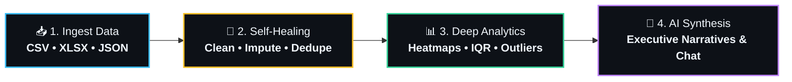
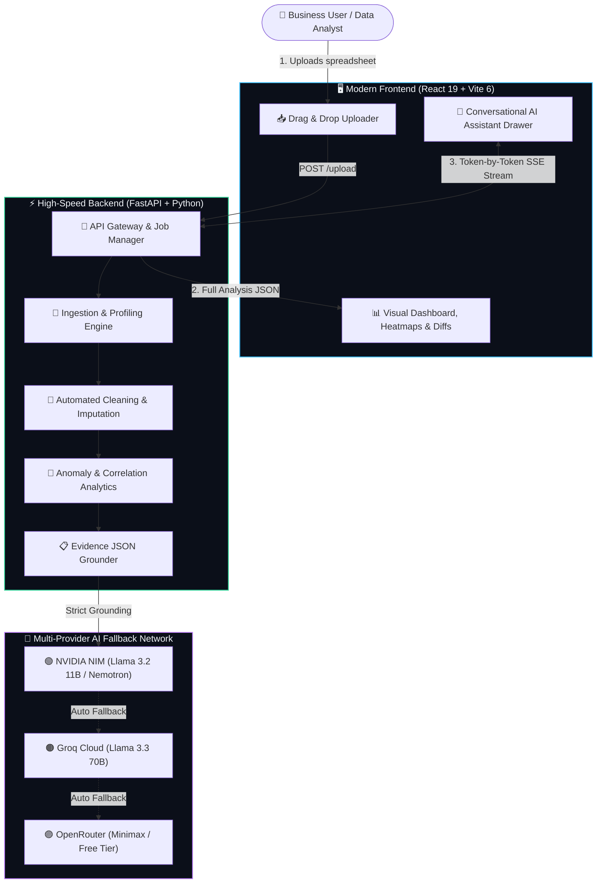

# 🔮 HackMee

> ### **An autonomous intelligence layer engineered to replace hours of manual data wrangling, statistical validation, and presentation prep.**

<p align="left">
  
  
  
  
  
  
  
</p>

---

## 🌟 What This Platform Provides

```
                                  HACKMEE INTELLIGENCE ENGINE
  ┌───────────────────────────┬───────────────────────────┬───────────────────────────┐
  │  🧹 Auto Data Cleaning    │  🧬 Deep Profiling        │  🎛️ Dynamic Filtering     │
  │  Self-healing tabular ETL │  Comprehensive schemas    │  Multi-dimensional slicing│
  ├───────────────────────────┼───────────────────────────┼───────────────────────────┤
  │  🚨 ML Anomaly Detection  │  📈 Interactive Visuals   │  🤖 AI Data Analyst       │
  │  IQR & Isolation Forest   │  Heatmaps & Recharts      │  Executive narratives     │
  └───────────────────────────┴───────────────────────────┴───────────────────────────┘
```

---

### 1. 🧹 Automated Data Cleaning `🟢 ACTIVE`
> **Self-healing tabular pipelines**  
> Deduplication, robust type conversion, and intelligent missing value imputation using KNN and median models.
* **Smart Deduplication:** Eliminates exact & near-duplicate rows automatically.
* **Auto-Type Casting:** Recognizes numbers, dates, timestamps, and categories across non-standard formats.
* **Intelligent Imputation:** Replaces missing nulls via median (numerical) and mode/KNN (categorical).
* **Side-by-Side Diff View:** Highlights exact cell changes before and after cleaning.

`🏷️ Tags:` `KNN Imputer` • `Deduplication` • `Type Casting` • `Whitespace Stripping`

---

### 2. 🧬 Deep Dataset Profiling `🟢 ACTIVE`
> **Comprehensive schema intelligence**  
> Quality scoring, column semantic classification (numeric, categorical, temporal), and automated health alerts.
* **0–100 Data Quality Score:** Instant metric assessing completeness, uniqueness, and consistency.
* **Semantic Column Tagging:** Identifies metrics (`# Numeric`), dimensions (`🔤 Categorical`), and timestamps (`📅 Date`).
* **Instant Cardinality & Null Ratios:** Immediate visibility into sparsity and unique value counts.

`🏷️ Tags:` `Quality Score` • `Schema Detection` • `Null Ratio` • `Distribution Metrics`

---

### 3. 🎛️ Dynamic Filtering `🟢 ACTIVE`
> **Multi-dimensional data slicing**  
> Multi-condition search, categorical slicers, and numeric range filtering to slice and isolate subsets instantly.
* **Global Search:** Instant keyword lookup across all columns and rows.
* **Categorical Slicers:** Interactive multi-select chips to focus on specific business segments.
* **Numeric Range Sliders:** Real-time upper and lower threshold filters with instant dashboard recalculation.

`🏷️ Tags:` `Multi-Condition` • `Range Sliders` • `Categorical Slicers` • `Global Search`

---

### 4. 🚨 ML Anomaly Detection `🟢 ACTIVE`
> **Dual-layer statistical screening**  
> Statistical IQR outlier boundaries and Scikit-Learn Isolation Forest machine learning for multi-dimensional anomaly flags.
* **IQR & Z-Score Boundaries:** Identifies numerical values exceeding $1.5 \times \text{IQR}$ fences.
* **Isolation Forest Screening:** Unsupervised ML flagging anomalous multi-variable behavior.
* **Outlier Distribution Impact:** Quantifies how extreme values distort column means and standard deviations.

`🏷️ Tags:` `Isolation Forest` • `IQR Boundaries` • `Z-Score Fences` • `Skewness Diagnostics`

---

### 5. 📈 Interactive Visualizations `🟢 ACTIVE`
> **High-performance visual rendering**  
> Dynamic charts optimized for large datasets with smart recommendations, multi-variable correlation heatmaps, and trend projections.
* **Smart Chart Recommendations:** Automatically suggests the best visual representations (Bar, Line, Scatter, Area).
* **Pearson Correlation Heatmap:** Hoverable matrix pinpointing positive and negative variable relationships.
* **Export Engine:** Download full reports and charts as high-resolution **PDF** or **PNG** with a single click.

`🏷️ Tags:` `Recharts/Plotly` • `Correlation Matrix` • `Adaptive Binning` • `PDF/PNG Export`

---

### 6. 🤖 AI Data Analyst `🟢 ACTIVE`
> **Automated executive narrative**  
> Autonomous plain-language narrative synthesis, statistical evidence extraction, and actionable business takeaways.
* **Grounded Executive Summary:** Generates clear, bulleted takeaways strictly from statistical evidence JSON.
* **Streaming Conversational Assistant:** Ask follow-up questions with live Server-Sent Events (SSE) token streaming.
* **Transparent Thinking Blocks:** Live `<thinking>` reasoning display so users can inspect the AI's logic step-by-step.
* **Tri-Tier Provider Fallback:** Automatic fallback chain (`NVIDIA NIM` ➔ `Groq Cloud` ➔ `OpenRouter`).

`🏷️ Tags:` `Executive Bullets` • `Evidence Extraction` • `Actionable Insights` • `SSE Streaming`

---

## 🔄 End-to-End Pipeline Workflow



---

## 🏛️ System Architecture



---

## ⚡ Quick Start Guide

Run the complete platform locally in less than 2 minutes.

### 🐍 1. Backend (FastAPI)

```bash
cd Backend

# 1. Install dependencies with uv
uv sync

# 2. Add your free API key to .env (NVIDIA, Groq, or OpenRouter)
cp .env.example .env

# 3. Start the API server (runs on port 8000)
uv run uvicorn api:app --reload --port 8000
```
> 📍 **Backend API:** [http://127.0.0.1:8000](http://127.0.0.1:8000)  
> 📖 **Interactive Swagger Docs:** [http://127.0.0.1:8000/docs](http://127.0.0.1:8000/docs)

---

### ⚛️ 2. Frontend (React + Vite)

```bash
cd Frontend

# 1. Install dependencies
npm install

# 2. Launch development server (runs on port 5173)
npm run dev
```
> 🌐 **Web Application:** [http://localhost:5173](http://localhost:5173)

---

## 🛠️ Technology Stack

| Domain | Technologies | Purpose |
| :--- | :--- | :--- |
| **Frontend Framework** | **React 19**, **TypeScript** | Dynamic component architecture |
| **Bundler & Tooling** | **Vite 6** | Instant HMR and fast compilation |
| **Styling & Theme** | **TailwindCSS v4**, **Lucide Icons** | Glassmorphic dark/light UI design system |
| **Visualizations** | **Recharts**, **Plotly** | Responsive charts, heatmaps, and scatter plots |
| **State Management** | **Zustand** | Minimalist global store for dataset lifecycle |
| **Backend Framework** | **FastAPI** (Python 3.11+) | Async REST endpoints & Server-Sent Events (SSE) |
| **Data Science Core** | **Pandas**, **NumPy**, **Scikit-learn**| Data profiling, KNN imputation, Isolation Forest |
| **AI / LLM Engine** | **NVIDIA NIM**, **Groq**, **OpenRouter** | Zero-hallucination structured narrative generation |
| **Export Engines** | **jsPDF**, **html2canvas** | High-resolution PDF & PNG report generator |

---

## 📡 REST & Streaming API Endpoints

| Method | Route | Description |
| :--- | :--- | :--- |
| `GET` | `/` | API status, version, and active service links |
| `GET` | `/health` | Liveness check |
| `POST` | `/upload` | Upload `.csv`, `.xlsx`, or `.json` file to trigger background pipeline |
| `GET` | `/status/{id}` | Poll execution stage (`detecting` ➔ `cleaning` ➔ `analyzing` ➔ `done`) |
| `GET` | `/analysis/{id}`| Fetch full analytical payload (Summary, Charts, Heatmap, Outliers, Diffs) |
| `GET` | `/history` | List processed datasets with health quality scores |
| `POST` | `/chat/stream` | Stream AI conversational tokens with `<thinking>` reasoning blocks |

---

## 📂 Repository Directory Layout

```
HackMee/
├── 📁 Backend/                         # FastAPI & Python Analytics Core
│   ├── 📁 src/
│   │   ├── 📁 ai/                     # LLM prompt builders, fallback engine & streaming chat
│   │   ├── 📁 analytics/              # Isolation Forest anomalies & dynamic query filters
│   │   ├── 📁 ingestion/              # Multi-format dataset loaders (CSV, Excel, JSON)
│   │   ├── 📁 preprocessing/          # Schema profiler, data cleaner & KNN imputation
│   │   └── 📁 visualization/          # Automated chart recommender & Plotly builders
│   ├── api.py                         # FastAPI server with REST & SSE endpoints
│   ├── app.py                         # Standalone Streamlit dashboard demo
│   └── pyproject.toml                 # Backend dependencies managed by uv
│
├── 📁 Frontend/                        # React 19 + TypeScript + Vite Web App
│   ├── 📁 src/
│   │   ├── 📁 components/             # Charts, AIChatPanel, Stepper, DataTable, UploadZone
│   │   ├── 📁 pages/                  # DashboardPage, LandingPage, UploadPage, ProcessingPage
│   │   └── 📁 store/                  # Zustand stores for analysis, theme, and auth
│   └── package.json                   # Frontend dependencies
│
└── README.md                          # Repository documentation
```

---

## 📜 License

Distributed under the **MIT License**. Free for personal, academic, and commercial use.

<div align="center">
  <sub>Built with ⚡ for automated, executive-ready data intelligence.</sub>
</div>