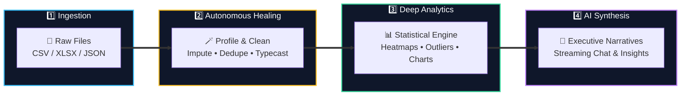
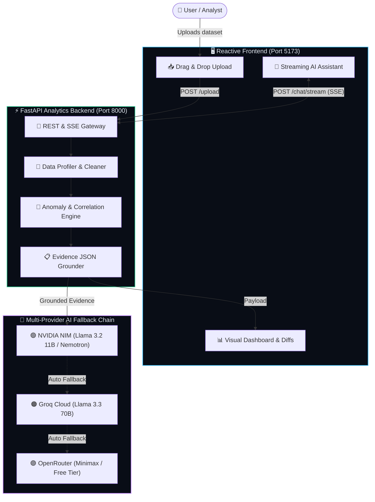

<div align="center">

# 🔮 HackMee
### *The Autonomous Intelligence Layer for Raw Tabular Data*

**Turn messy spreadsheets (`.csv`, `.xlsx`, `.json`) into self-healed datasets, high-impact visualizations, and executive AI narratives in seconds.**

<br/>

[](https://fastapi.tiangolo.com)
[](https://react.dev)
[](https://www.typescriptlang.org)
[](https://vitejs.dev)
[](https://tailwindcss.com)
[](https://build.nvidia.com)

</div>

---

## ⚡ Core Capabilities

<table>
<tr>
<td width="33%" valign="top">

### 🪄 Automated Data Cleaning
*Self-healing tabular pipelines*
- 🧹 Smart deduplication & whitespace normalization
- 🕒 Automatic date detection across diverse formats
- 🧪 Median & mode missing value imputation
- ⚖️ Before vs. After cleaning diff viewer

</td>
<td width="33%" valign="top">

### 🧬 Deep Dataset Profiling
*Comprehensive schema intelligence*
- 🏆 0–100 Data Quality Health Score
- 🏷️ Semantic column classification (numeric/categorical/date)
- 📊 Instant distribution & cardinality metrics
- ⚠️ Automated null ratio & anomaly alerts

</td>
<td width="33%" valign="top">

### 🎛️ Dynamic Slicing & Filtering
*Multi-dimensional data exploration*
- 🔍 Instant global keyword search
- 🎯 Dynamic categorical multi-select slicers
- 📐 Numeric range & condition filters
- ⚡ Live recalculation of visual statistics

</td>
</tr>
<tr>
<td width="33%" valign="top">

### 🚨 ML Anomaly Detection
*Dual-layer statistical screening*
- 📐 IQR statistical outlier boundary flags
- 🤖 Scikit-Learn Isolation Forest screening
- 🎯 Extreme value tagging and distribution impact
- 🛡️ Data drift & skewness diagnostics

</td>
<td width="33%" valign="top">

### 📈 Interactive Visual Studio
*High-performance reactive rendering*
- 📊 Dynamic Recharts (Bar, Line, Scatter, Area)
- 🌡️ Interactive Pearson Correlation Heatmap
- 💡 Automatic chart recommendation heuristics
- 📑 High-resolution PDF & PNG report export

</td>
<td width="33%" valign="top">

### 🧠 Conversational AI Analyst
*Grounded executive narratives*
- 📝 Structured Executive Summaries & Recommendations
- 💬 SSE streaming chat with live dataset context
- 💭 Transparent `<thinking>` reasoning display
- ⛓️ Tri-tier fallback (NVIDIA ➔ Groq ➔ OpenRouter)

</td>
</tr>
</table>

---

## 🔄 How HackMee Works



---

## 🏛️ Architecture Flow



---

## 🚀 Quick Start

Get the full platform running locally in 2 minutes:

### 1️⃣ Backend Setup

```bash
cd Backend

# Install dependencies using uv
uv sync

# Configure your API key (NVIDIA, Groq, or OpenRouter)
cp .env.example .env

# Launch FastAPI backend
uv run uvicorn api:app --reload --port 8000
```
> 📍 Backend runs on **`http://127.0.0.1:8000`** (Swagger docs at `/docs`)

---

### 2️⃣ Frontend Setup

```bash
cd Frontend

# Install node packages
npm install

# Start Vite dev server
npm run dev
```
> 📍 Open **`http://localhost:5173`** in your browser!

---

## 🧰 Technology Stack

| Domain | Tech | Role in Platform |
| :--- | :--- | :--- |
| **Frontend** | React 19 + TypeScript | High-speed reactive component hierarchy |
| **Tooling** | Vite 6 | Sub-second Hot Module Replacement (HMR) & bundling |
| **Design** | TailwindCSS v4 | Sleek dark-mode aesthetic with glassmorphism |
| **Visuals** | Recharts & Plotly | Interactive heatmaps, bar charts, scatter plots |
| **State** | Zustand | Lightweight client-side store |
| **Backend** | FastAPI (Python 3.11+) | Asynchronous REST & Server-Sent Events (SSE) |
| **Data Engine**| Pandas, NumPy, Scikit-Learn | Schema profiling, KNN/median cleaning, IQR anomalies |
| **AI Inference**| NVIDIA NIM, Groq, OpenRouter | Multi-model fallback chain for zero-hallucination analysis |
| **Export** | jsPDF & html2canvas | Executive PDF & PNG report generator |

---

## 📡 Key API Endpoints

| Method | Endpoint | Description |
| :--- | :--- | :--- |
| `POST` | `/upload` | Ingests `.csv`, `.xlsx`, or `.json` and triggers background pipeline |
| `GET` | `/status/{id}` | Live poll stage (`detecting` ➔ `cleaning` ➔ `analyzing` ➔ `done`) |
| `GET` | `/analysis/{id}`| Retrieves complete analysis JSON (summary, charts, heatmap, diffs) |
| `GET` | `/history` | Returns previous dataset sessions and health scores |
| `POST` | `/chat/stream` | Streams conversational AI tokens with `<thinking>` reasoning blocks |

---

## 📂 Project Organization

```
HackMee/
├── 📁 Backend/               # Python & FastAPI Engine
│   ├── 📁 src/
│   │   ├── 📁 ai/            # Multi-provider LLM client & streaming chat
│   │   ├── 📁 analytics/     # Anomaly detector & dynamic filters
│   │   ├── 📁 ingestion/     # File loaders (.csv, .xlsx, .json)
│   │   ├── 📁 preprocessing/ # Automated profiler & cleaner
│   │   └── 📁 visualization/ # Chart generation logic
│   ├── api.py               # Main FastAPI server entrypoint
│   └── pyproject.toml       # Python package configuration
│
├── 📁 Frontend/              # React 19 + Vite Dashboard
│   ├── 📁 src/
│   │   ├── 📁 components/    # Reusable UI (Charts, Chat, Stepper, Table, Export)
│   │   ├── 📁 pages/         # Dashboard, Upload, Processing, Landing
│   │   └── 📁 store/         # Zustand global state stores
│   └── package.json         # Node.js dependencies
│
└── README.md                # Project documentation
```

---

## 📜 License

Distributed under the **MIT License**. Free for research, personal, and commercial usage.

<div align="center">
  <sub>Engineered with ⚡ for automated data intelligence.</sub>
</div>