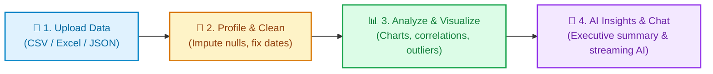
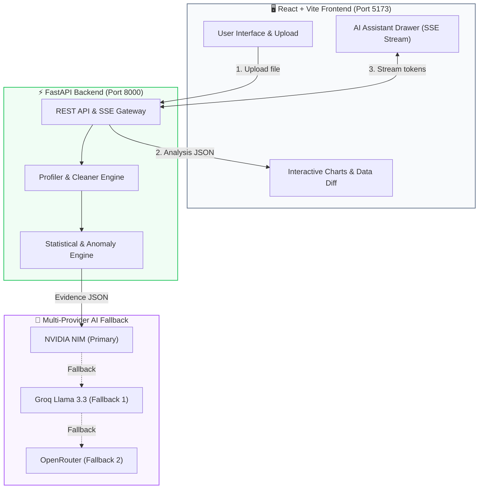

<div align="center">

# ⚡ HackMee
### *Automated AI Data Analyst Dashboard*

Turn raw datasets (`.csv`, `.xlsx`, `.json`) into clean data, interactive charts, and executive AI insights in seconds.

[](https://fastapi.tiangolo.com)
[](https://react.dev)
[](https://www.typescriptlang.org)
[](https://vitejs.dev)
[](https://tailwindcss.com)
[](https://build.nvidia.com)

</div>

---

## 🎯 How It Works

Upload a spreadsheet, and HackMee automatically handles the entire analysis lifecycle:



---

## 🏗️ System Architecture

A clean, modern decoupled architecture connecting a React frontend with a high-speed FastAPI backend and multi-provider AI:



---

## 🚀 Quick Start

Run both the frontend and backend in less than a minute.

### 1. Backend (FastAPI)

```bash
cd Backend

# 1. Install dependencies
uv sync

# 2. Add your free API key in .env (NVIDIA, Groq, or OpenRouter)
cp .env.example .env

# 3. Start server (runs on http://127.0.0.1:8000)
uv run uvicorn api:app --reload --port 8000
```

### 2. Frontend (React + Vite)

```bash
cd Frontend

# 1. Install dependencies
npm install

# 2. Start dev server (runs on http://localhost:5173)
npm run dev
```

> 💡 Open **[http://localhost:5173](http://localhost:5173)** in your browser to use the app!

---

## 🛠️ Tech Stack

| Component | Technology | Description |
| :--- | :--- | :--- |
| **Frontend** | React 19, TypeScript, Vite | Fast, modern interactive UI |
| **Styling** | TailwindCSS v4, Lucide Icons | Responsive glassmorphic dark & light mode |
| **Charts** | Recharts, Plotly | Interactive bar, line, scatter & correlation heatmaps |
| **State** | Zustand | Simple and lightweight global state |
| **Backend** | FastAPI (Python 3.11+) | Async REST API & Server-Sent Events (SSE) |
| **Data Engine** | Pandas, NumPy, Scikit-learn | Profiling, cleaning, IQR outlier detection |
| **AI / LLMs** | NVIDIA NIM, Groq, OpenRouter | Llama 3.2, Llama 3.3, Nemotron with auto-fallback |

---

## 📡 API Endpoints

| Method | Endpoint | Description |
| :--- | :--- | :--- |
| `POST` | `/upload` | Upload CSV / Excel / JSON dataset for processing |
| `GET` | `/status/{id}` | Check pipeline progress (`detecting` ➔ `cleaning` ➔ `analyzing` ➔ `done`) |
| `GET` | `/analysis/{id}` | Get full dataset summary, charts, outliers, and metrics |
| `GET` | `/history` | List all processed datasets |
| `POST` | `/chat/stream` | Stream AI assistant answers using dataset context |
| `GET` | `/docs` | Interactive Swagger API documentation |

---

## 📂 Project Structure

```
HackMee/
├── 📁 Backend/               # FastAPI backend & data processing
│   ├── 📁 src/
│   │   ├── 📁 ai/            # LLM prompts, fallback client & streaming chat
│   │   ├── 📁 analytics/     # Anomaly detector & filters
│   │   ├── 📁 ingestion/     # File loaders (.csv, .xlsx, .json)
│   │   ├── 📁 preprocessing/ # Profiler & cleaner
│   │   └── 📁 visualization/ # Chart generators
│   ├── api.py               # Main FastAPI server
│   └── pyproject.toml       # Backend dependencies
│
├── 📁 Frontend/              # React + Vite application
│   ├── 📁 src/
│   │   ├── 📁 components/    # Reusable UI (Charts, Chat, Stepper, Table)
│   │   ├── 📁 pages/         # Dashboard, Upload, Processing, Landing
│   │   └── 📁 store/         # Zustand global state
│   └── package.json         # Frontend dependencies
│
└── README.md                # Project documentation
```

---

## 📄 License

MIT License. Free for personal and commercial use.